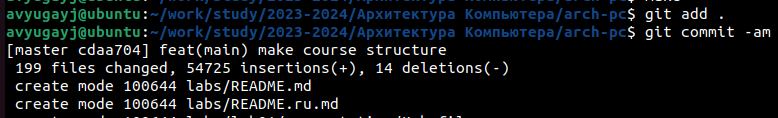
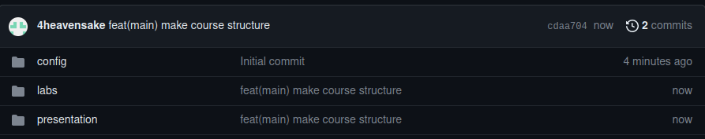

---
## Front matter
title: "Отчёт по лабораторной работе №2"
subtitle: "Простейший вариант"
author: "Югай Александр Витальевич"

## Generic otions
lang: ru-RU
toc-title: "Содержание"

## Bibliography
bibliography: bib/cite.bib
csl: pandoc/csl/gost-r-7-0-5-2008-numeric.csl

## Pdf output format
toc: true # Table of contents
toc-depth: 2
lof: true # List of figures
lot: true # List of tables
fontsize: 12pt
linestretch: 1.5
papersize: a4
documentclass: scrreprt
## I18n polyglossia
polyglossia-lang:
  name: russian
  options:
	- spelling=modern
	- babelshorthands=true
polyglossia-otherlangs:
  name: english
## I18n babel
babel-lang: russian
babel-otherlangs: english
## Fonts
mainfont: PT Serif
romanfont: PT Serif
sansfont: PT Sans
monofont: PT Mono
mainfontoptions: Ligatures=TeX
romanfontoptions: Ligatures=TeX
sansfontoptions: Ligatures=TeX,Scale=MatchLowercase
monofontoptions: Scale=MatchLowercase,Scale=0.9
## Biblatex
biblatex: true
biblio-style: "gost-numeric"
biblatexoptions:
  - parentracker=true
  - backend=biber
  - hyperref=auto
  - language=auto
  - autolang=other*
  - citestyle=gost-numeric
## Pandoc-crossref LaTeX customization
figureTitle: "Рис."
tableTitle: "Таблица"
listingTitle: "Листинг"
lofTitle: "Список иллюстраций"
lotTitle: "Список таблиц"
lolTitle: "Листинги"
## Misc options
indent: true
header-includes:
  - \usepackage{indentfirst}
  - \usepackage{float} # keep figures where there are in the text
  - \floatplacement{figure}{H} # keep figures where there are in the text
---

# Цель работы

Целью работы является изучить идеологию и применение средств контроля
версий. Приобрести практические навыки по работе с системой git

# Теоретическое введение

Системы контроля версий (Version Control System, VCS) применяются при
работе нескольких человек над одним проектом. Обычно основное дерево проекта
хранится в локальном или удалённом репозитории, к которому настроен доступ для
участников проекта. При внесении изменений в содержание проекта система контроля
версий позволяет их фиксировать, совмещать изменения, произведённые разными
участниками проекта, производить откат к любой более ранней версии проекта, если
это требуется. В классических системах контроля версий используется
централизованная модель, предполагающая наличие единого репозитория для
хранения файлов. Выполнение большинства функций по управлению версиями
осуществляется специальным сервером. Участник проекта (пользователь) перед
началом работы посредством определённых команд получает нужную ему версию
файлов. После внесения изменений, пользователь размещает новую версию в
хранилище. При этом предыдущие версии не удаляются из центрального хранили-
ща и к ним можно вернуться в любой момент. Сервер может сохранять не полную
версию изменённых файлов, а производить так называемую дельта-компрессию —
сохранять только изменения между последовательными версиями, что позволяет
уменьшить объём хранимых данных. Системы контроля версий поддерживают
возможность отслеживания и разрешения кон-
фликтов, которые могут возникнуть при работе нескольких человек над одним
файлом. Можно объединить (слить) изменения, сделанные разными участниками
(автоматически или вручную), вручную выбрать нужную версию, отменить изменения
вовсе или заблокировать файлы для изменения. В зависимости от настроек
блокировка не позволяет другим пользователям получить рабочую копию или
препятствует изменению рабочей копии файла средствами файловой системы ОС,
обеспечивая таким образом, привилегированный доступ
только одному пользователю, работающему с файлом.

# Выполнение лабораторной работы

**Настройка github.**

Создайте учётную запись на сайте https://github.com/ и заполните основные
данные

До выполнения данной лабораторной работы, я уже имел профиль в github и просто
зашел в него.

**Базовая настройка git.**

Сначала сделаем предварительную конфигурацию git. Откройте терминал и
введите следующие команды, указав имя и email владельца репозитория

Используя данные в лабораторной работе команды, я сделал предварительную
конфигурацию на основе моего имени и моей почты

Настроим utf-8 в выводе сообщений git

Зададим имя начальной ветки (будем называть её master)

Параметр autocrlf:

Параметр safecrlf:

**Создание SSH ключа**

Для последующей идентификации пользователя на сервере репозиториев
необходимо генерировать пару ключей (приватный и открытый):
ssh-keygen -C "Имя Фамилия <work@mail>"

С помощью данной в лабораторной работе команды, я сгенерировал пару ключей

Далее необходимо загрузить сгенерённый открытый ключ. Скопировав из локальной
консоли ключ в буфер обмена.

Используя команду cat, я вывел в консоль сгенерированый мною ключ

 Следуя инструкциям в лабораторной работе, я загрузил ключ на github

**Сознание рабочего пространства и репозитория курса на основе шаблона**

Откройте терминал и создайте каталог для предмета «Архитектура
компьютера»

Используя команду mkdir с опцией -р, я создал цепочку каталогов.

**Сознание репозитория курса на основе шаблон**

В открывшемся окне задайте имя репозитория (Repository name) study_2023–
2024_arh-pc и создайте репозиторий (кнопка Create repository from template)

Следуя инструкциям в лабораторной работе, я создал репозиторий по данному мне
шаблону

Откройте терминал и перейдите в каталог курса:

Клонируйте созданный репозиторий:

Благодаря команде git clone, я клонировал репозиторий из github в мою систему

**Настройка каталога курса**

Перейдите в каталог курса:

Удалите лишние файлы:

rm package.json

Создайте необходимые каталоги:

echo arch-pc > COURSE

make

Благодаря команде echo я создал файл в моем древе каталогов

Отправьте файлы на сервер:

git add .

git commit -am 'feat(main): make course structure'

git push

Благодаря данным командам из лабораторной работы, я синхронизировал файлы со
средой github

Проверьте правильность создания иерархии рабочего пространства в локальном
репозитории и на странице github

**Задания для самостоятельной работы.**

Создайте отчет по выполнению лабораторной работы в соответствующем
каталоге рабочего пространства (labs>lab02>report)

Скопируйте отчеты по выполнению предыдущих лабораторных работ в
соответствующие каталоги созданного рабочего пространства.

Загрузите файлы на github

Благодаря уже известным мне командам, я синхронизировал все изменения в системе
со средой github

# Выводы

В ходе выполнения лабораторной работы были изучены идеологии и
применение средств контроля версий. Также были приобретены практические навыки
по работе с системой git

