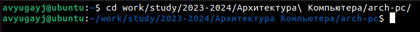
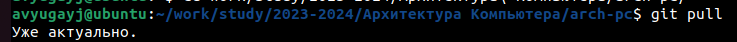
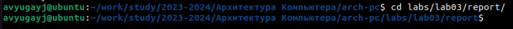
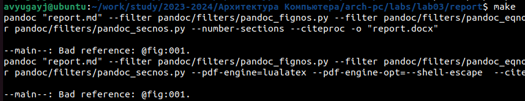
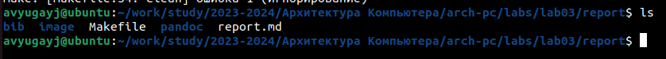
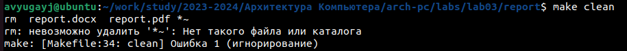
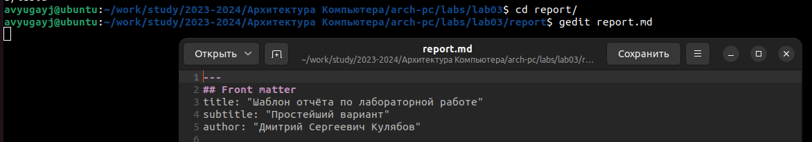
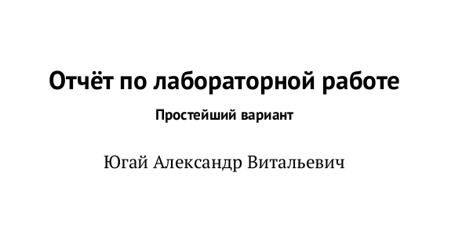
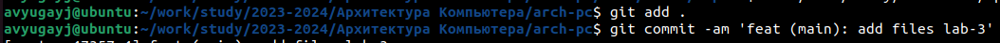
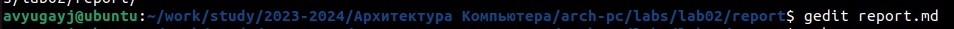

---
## Front matter
title: "Отчёт по лабораторной работе"
subtitle: "Простейший вариант"
author: "Югай Александр Витальевич"

## Generic otions
lang: ru-RU
toc-title: "Содержание"

## Bibliography
bibliography: bib/cite.bib
csl: pandoc/csl/gost-r-7-0-5-2008-numeric.csl

## Pdf output format
toc: true # Table of contents
toc-depth: 2
lof: true # List of figures
lot: true # List of tables
fontsize: 12pt
linestretch: 1.5
papersize: a4
documentclass: scrreprt
## I18n polyglossia
polyglossia-lang:
  name: russian
  options:
	- spelling=modern
	- babelshorthands=true
polyglossia-otherlangs:
  name: english
## I18n babel
babel-lang: russian
babel-otherlangs: english
## Fonts
mainfont: PT Serif
romanfont: PT Serif
sansfont: PT Sans
monofont: PT Mono
mainfontoptions: Ligatures=TeX
romanfontoptions: Ligatures=TeX
sansfontoptions: Ligatures=TeX,Scale=MatchLowercase
monofontoptions: Scale=MatchLowercase,Scale=0.9
## Biblatex
biblatex: true
biblio-style: "gost-numeric"
biblatexoptions:
  - parentracker=true
  - backend=biber
  - hyperref=auto
  - language=auto
  - autolang=other*
  - citestyle=gost-numeric
## Pandoc-crossref LaTeX customization
figureTitle: "Рис."
tableTitle: "Таблица"
listingTitle: "Листинг"
lolTitle: "Листинги"
## Misc options
indent: true
header-includes:
  - \usepackage{indentfirst}
  - \usepackage{float} # keep figures where there are in the text
  - \floatplacement{figure}{H} # keep figures where there are in the text
---

# Цель работы

Целью работы является освоение процедуры оформления отчетов с помощью легковесного
языка разметки Markdown

# Выполнение лабораторной работы

Откройте терминал

Перейдите в каталог курса сформированный при выполнении лабораторной работы
№2:

Обновите локальный репозиторий, скачав изменения из удаленного репозитория с помо-
щью команды

Перейдите в каталог с шаблоном отчета по лабораторной работе № 3

Проведите компиляцию шаблона с использованием Makefile. Для этого введите ко-
манду

При успешной компиляции должны сгенерироваться файлы report.pdf и report.docx.
Откройте и проверьте корректность полученных файлов.

Удалите полученный файлы с использованием Makefile. Для этого введите команду

Откройте файл report.md c помощью любого текстового редактора, например gedit

Заполните отчет и скомпилируйте отчет с использованием Makefile. Проверьте кор-
ректность полученных файлов. (Обратите внимание, для корректного отображения
скриншотов они должны быть размещены в каталоге image)

Загрузите файлы на Github

# Задание для самостоятельной работы

В соответствующем каталоге сделайте отчёт по лабораторной работе № 2 в формате
Markdown. В качестве отчёта необходимо предоставить отчёты в 3 форматах: pdf, docx
и md.

Загрузите файлы на Github.

# Выводы

В ходе выполнения лабораторной работы, я освоил процедуры оформления отчетов с помощью легковесного языка разметки MarkDown

