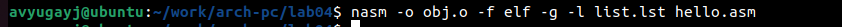

---
## Front matter
title: "Отчёт по лабораторной работе №4"
subtitle: "Создание и процесс обработки программ на языке ассемблера NASM"
author: "Югай Александр Витальевич"

## Generic otions
lang: ru-RU
toc-title: "Содержание"

## Bibliography
bibliography: bib/cite.bib
csl: pandoc/csl/gost-r-7-0-5-2008-numeric.csl

## Pdf output format
toc: true # Table of contents
toc-depth: 2
lof: true # List of figures
lot: true # List of tables
fontsize: 12pt
linestretch: 1.5
papersize: a4
documentclass: scrreprt
## I18n polyglossia
polyglossia-lang:
  name: russian
  options:
	- spelling=modern
	- babelshorthands=true
polyglossia-otherlangs:
  name: english
## I18n babel
babel-lang: russian
babel-otherlangs: english
## Fonts
mainfont: PT Serif
romanfont: PT Serif
sansfont: PT Sans
monofont: PT Mono
mainfontoptions: Ligatures=TeX
romanfontoptions: Ligatures=TeX
sansfontoptions: Ligatures=TeX,Scale=MatchLowercase
monofontoptions: Scale=MatchLowercase,Scale=0.9
## Biblatex
biblatex: true
biblio-style: "gost-numeric"
biblatexoptions:
  - parentracker=true
  - backend=biber
  - hyperref=auto
  - language=auto
  - autolang=other*
  - citestyle=gost-numeric
## Pandoc-crossref LaTeX customization
figureTitle: "Рис."
tableTitle: "Таблица"
listingTitle: "Листинг"
lofTitle: "Список иллюстраций"
lotTitle: "Список таблиц"
lolTitle: "Листинги"
## Misc options
indent: true
header-includes:
  - \usepackage{indentfirst}
  - \usepackage{float} # keep figures where there are in the text
  - \floatplacement{figure}{H} # keep figures where there are in the text
---

# Цель работы

Освоение процедуры компиляции и сборки программ, написанных на ассемблере NASM.

# Задание

Написать программу на Ассемблере с выводом "Hello World!" и своего ФИО

# Выполнение лабораторной работы

## Программа Hello World!

Создайте каталог для работы с программами на языке ассемблера NASM

Перейдите в созданный каталог

Создайте текстовый файл с именем hello.asm

Откройте этот файл с помощью любого текстового редактора, например, gedit

и введите в него следующий текст:

## Транслятор NASM

Преобразуем текстовый файл в объектный код

Проверяем правильность выполнения команды

## Расширенный синтаксис командной строки NASM

Компилируем исходный файл

Проверяем правильность выполнения команды

## Компоновщик LD

Передаем объектный файл на обработку компоновщику

Проверяем создался ли исполняемый файл

Передаем объектный файл obj.o на обработку компоновщику

Проверяем правильно выполнения команды

## Запуск исполняемого файла

Запускаем выполняемый файл 

## Задание для самостоятельной работы

Копируем файл hello.asm

Открываем файл и меняем Hello World на свое имя и фамилию

Прописываем те же команды, что и с первой программой

Копируем файлы в локальный репозиторий

Переходим в каталог лабораторных работ и загружаем файлы на github

# Выводы

Мы освоили процедуры компиляции и сборки программ, написанных на ассемблере NASM

