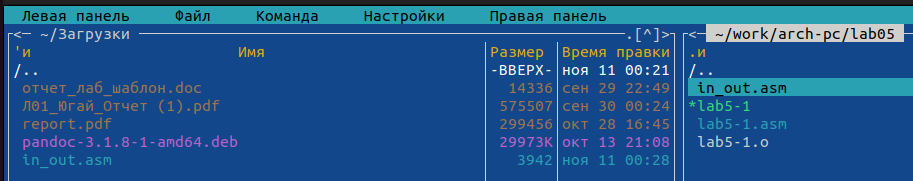
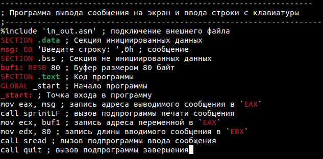

---
## Front matter
title: "Отчет по лабораторной работе №5"
subtitle: "Основы работы с Midnight Commander (mc)"
author: "Югай Александр Витальевич"

## Generic otions
lang: ru-RU
toc-title: "Содержание"

## Bibliography
bibliography: bib/cite.bib
csl: pandoc/csl/gost-r-7-0-5-2008-numeric.csl

## Pdf output format
toc: true # Table of contents
toc-depth: 2
lof: true # List of figures
lot: true # List of tables
fontsize: 12pt
linestretch: 1.5
papersize: a4
documentclass: scrreprt
## I18n polyglossia
polyglossia-lang:
  name: russian
  options:
	- spelling=modern
	- babelshorthands=true
polyglossia-otherlangs:
  name: english
## I18n babel
babel-lang: russian
babel-otherlangs: english
## Fonts
mainfont: PT Serif
romanfont: PT Serif
sansfont: PT Sans
monofont: PT Mono
mainfontoptions: Ligatures=TeX
romanfontoptions: Ligatures=TeX
sansfontoptions: Ligatures=TeX,Scale=MatchLowercase
monofontoptions: Scale=MatchLowercase,Scale=0.9
## Biblatex
biblatex: true
biblio-style: "gost-numeric"
biblatexoptions:
  - parentracker=true
  - backend=biber
  - hyperref=auto
  - language=auto
  - autolang=other*
  - citestyle=gost-numeric
## Pandoc-crossref LaTeX customization
figureTitle: "Рис."
tableTitle: "Таблица"
listingTitle: "Листинг"
lofTitle: "Список иллюстраций"
lotTitle: "Список таблиц"
lolTitle: "Листинги"
## Misc options
indent: true
header-includes:
  - \usepackage{indentfirst}
  - \usepackage{float} # keep figures where there are in the text
  - \floatplacement{figure}{H} # keep figures where there are in the text
---

# Цель работы

Приобретение практических навыков работы в Midnight Commander. Освоение инструкций
языка ассемблера mov и int.

# Задание

Написать 2 программы по примеру и внести изменения по их условию 

# Выполнение лабораторной работы

## Порядок выполнения лабораторной работы

Откройте Midnight Commander

Переходим в каталог, созданный при выполнении 4 лабораторной работы 

Создаем каталог lab05

Создаем файл lab5-1.asm

Открываем файл для редактирования и заполняем его по листингу

Открываем файл для просмотра

Транслируем текст программы и запускаем исполняемый файл

Скачиваем файл с туиса

Копируем в нужную директорию

Создаем копию файла lab5-1.asm и проверяем

Открываем файл и заполняем в соответствии с листингом 

Транслируем и запускаем файл

Снова открываем файл и меняем sprintLF на sprint

Транслируем файл и запускаем

Замечаем, что sprint выводит текст в той же строке, а spintLF, выводит с новой

### Задание для самостоятельной работы

Создаем копию файла lab5-1.asm и называем его также

Редактируем файл, чтобы введенный текст выводился в консоль

Транслируем файл и запускаем программу

Создаем копию файла lab5-2.asm и называем его также

Редактируем файл, чтобы введенный текст, выводился в консоль

Транслируем файл и запускаем программу

# Выводы

Мы приобрели навыки работы с Midnight Commander и освоили инструкции mov и int

