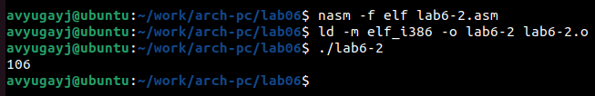

---
## Front matter
title: "Отчёт по лабораторной работе"
subtitle: "Арифметические операции в NASM."
author: "Югай Александр Витальевич"

## Generic otions
lang: ru-RU
toc-title: "Содержание"

## Bibliography
bibliography: bib/cite.bib
csl: pandoc/csl/gost-r-7-0-5-2008-numeric.csl

## Pdf output format
toc: true # Table of contents
toc-depth: 2
lof: true # List of figures
lot: true # List of tables
fontsize: 12pt
linestretch: 1.5
papersize: a4
documentclass: scrreprt
## I18n polyglossia
polyglossia-lang:
  name: russian
  options:
	- spelling=modern
	- babelshorthands=true
polyglossia-otherlangs:
  name: english
## I18n babel
babel-lang: russian
babel-otherlangs: english
## Fonts
mainfont: PT Serif
romanfont: PT Serif
sansfont: PT Sans
monofont: PT Mono
mainfontoptions: Ligatures=TeX
romanfontoptions: Ligatures=TeX
sansfontoptions: Ligatures=TeX,Scale=MatchLowercase
monofontoptions: Scale=MatchLowercase,Scale=0.9
## Biblatex
biblatex: true
biblio-style: "gost-numeric"
biblatexoptions:
  - parentracker=true
  - backend=biber
  - hyperref=auto
  - language=auto
  - autolang=other*
  - citestyle=gost-numeric
## Pandoc-crossref LaTeX customization
figureTitle: "Рис."
tableTitle: "Таблица"
listingTitle: "Листинг"
lofTitle: "Список иллюстраций"
lolTitle: "Листинги"
## Misc options
indent: true
header-includes:
  - \usepackage{indentfirst}
  - \usepackage{float} # keep figures where there are in the text
  - \floatplacement{figure}{H} # keep figures where there are in the text
---

# Цель работы

Освоение арифметических инструкций языка ассемблера NASM

# Задание

Написать программы для решения выражений

# Выполнение лабораторной работы

Создаем каталог для программ Лаб6, и в нем создаем файл

Открываем файл в Midnight Commander и заполняем его в соответствии с листингом 6.1

Создаем исполняемый файл и запускаем его 

Снова открываем файл для редактирования и убиравем кавычки с числовых значений

Создаем исполняемый файл и запускаем его 

Создаем новый файл в каталоге 

Заполняем файл в соответствии с листингом 6.2 

Создаем исполняемый файл и запускаем его

Снова открываем файл для редактирования и убиравем кавычки с числовых значений

Создаем исполняемый файл и запускаем его

Снова открываем файл для редактирования и меняем iprintLF на iprint 

Создаем исполняемый файл и запускаем его

Вывод функций iprintLF и iprint отличаются только тем, что LF переносит на новую строку.

## Выполнение арифметических операций в NASM

Создаем новый файл в каталоге

Открываем файл и редактируем в соответствии с листингом 6.3 

Создаем исполняемый файл и запускаем его

Открываем файл и редактируем его для вычисления выражения f(x) = (5 ∗ 2 + 3)/3

Компилируем файл и запускаем программу

Создаем новый файл в каталоге

Открываем файл и редактируем в соответствии с листингом 6.4

Компилируем файл и запускаем его

## Ответы на вопросы по программе

1. Строка "moveax.rem" и строка "call sprint" отвечают за вывод на экран сообщения 'Ваш вариант:'.
2. Эти инструкции используются для чтения строки с вводом данных от пользователя. Начальный адрес строки сохраняется в регистре есх, а количество символов в строке (максимальное количество символов, которое может быть считано) сохраняется в регистре edx. Затем вызывается процедура sread, которая выполняет чтение строки.
3. Инструкция "call atoi" используется для преобразования строки в целое число. Она принимает адрес строки в регистре еах и возвращает полученное число в регистре еaх.
4. Строка "xoredx.edx" обнуляет регистр. edx перед выполнением деления. Строка "movebx,20" загружает значение 20 в регистр ebx. Строка "divebx" выполняет деление регистра еах на значение регистра ebx с сохранением частного в регистре еах и остатка в регистре edx,
5. Остаток от деления записывается в регистр edx.
6. Инструкция "inc edx" используется для увеличения значения в регистре edx на 1. В данном случае, она увеличивает остаток от деления на 1.
7. Строка "moy eax.edx" передает значение остатка от деления в регистр eax. 36 Строка "call iprintLF" вызывает процедуруiprintLF для вывода значения на экран вместе с переводом строки. 

## Задание для самостоятельной работы

Создаем новый файл в каталоге

Открываем его и заполняем, чтобы решалось выражение f(x) = (2+x)^2

Компилируем программу и проверяем для x=2

Проверяем для x=8

# Выводы

Мы приобрели навыки создания исполнительных файлов для решения выражений и освоили 
арифметические инструкции в NASM.

