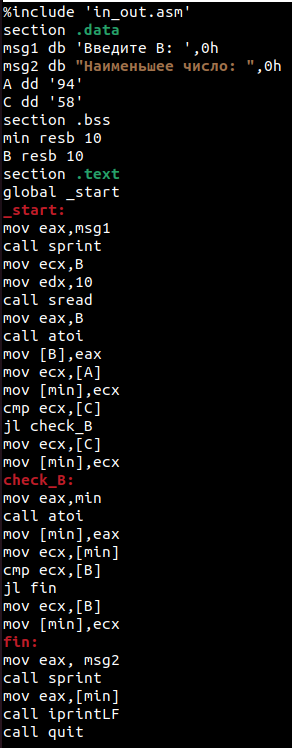

---
## Front matter
title: "Отчёт по лабораторной работе №7"
subtitle: "Команды безусловного и условного переходов в Nasm. Программирование ветвлений"
author: "Югай Александр Витальевич"

## Generic otions
lang: ru-RU
toc-title: "Содержание"

## Bibliography
bibliography: bib/cite.bib
csl: pandoc/csl/gost-r-7-0-5-2008-numeric.csl

## Pdf output format
toc: true # Table of contents
toc-depth: 2
lof: true # List of figures
lot: true # List of tables
fontsize: 12pt
linestretch: 1.5
papersize: a4
documentclass: scrreprt
## I18n polyglossia
polyglossia-lang:
  name: russian
  options:
	- spelling=modern
	- babelshorthands=true
polyglossia-otherlangs:
  name: english
## I18n babel
babel-lang: russian
babel-otherlangs: english
## Fonts
mainfont: PT Serif
romanfont: PT Serif
sansfont: PT Sans
monofont: PT Mono
mainfontoptions: Ligatures=TeX
romanfontoptions: Ligatures=TeX
sansfontoptions: Ligatures=TeX,Scale=MatchLowercase
monofontoptions: Scale=MatchLowercase,Scale=0.9
## Biblatex
biblatex: true
biblio-style: "gost-numeric"
biblatexoptions:
  - parentracker=true
  - backend=biber
  - hyperref=auto
  - language=auto
  - autolang=other*
  - citestyle=gost-numeric
## Pandoc-crossref LaTeX customization
figureTitle: "Рис."
tableTitle: "Таблица"
listingTitle: "Листинг"
lofTitle: "Список иллюстраций"
lolTitle: "Листинги"
## Misc options
indent: true
header-includes:
  - \usepackage{indentfirst}
  - \usepackage{float} # keep figures where there are in the text
  - \floatplacement{figure}{H} # keep figures where there are in the text
---

# Цель работы

Освоить условного и безусловного перехода. Ознакомиться с назначением и структурой файла 
листинга.

# Задание

Написать программы для решения системы выражений.

# Выполнение лабораторной работы

## Реализация переходов в NASM

Создаем каталог для программ Лаб7, и в нем создаем файл

Открываем файл в Midnight Commander и заполняем его в соответствии с листингом 7.1

Создаем исполняемый файл и запускаем его 

Снова открываем файл для редактирования и изменяем его в соответствии с листингом 7.2

Создаем исполняемый файл и запускаем его 

Снова открываем файл для редактирования и изменяем его, чтобы произошел данный вывод

Создаем исполняемый файл и запускаем его

Создаем новый файл

Открываем файл в Midnight Commander и заполняем его в соответствии с листингом 7.3

Создаем исполняемый файл и проверяем его работу, вводя разные значения B 

## Изучение структуры файлы листинга

Создаем файл листинга дла программы lab7-2.asm

Открываем файл листинга с помощью команды mcedit и изучаем его 

Строка 33: 0000001D-адрес в сегменте кода, BB01000000-машинный код, mov ebx,1-присвоение 
переменной ecx значения 1.

Строка 34: 00000022-адрес в сегменте кода, B804000000-машинный код, mov eax,4-присвоение 
переменной eax значения 4.

Строка 35 00000027-адрес в сегменте кода, CD80-машинный код, int 80h-вызов ядра.

Открываем файл и удаляем один операндум

Транслируем с получением файла листинга

При трансляции файла, выдается ошибка, но создаются исполнительный файл lab7-2 и lab7-2.lst

Снова открываем файл листинга и изучаем его 

## Задание для самостоятельной работы

Вариант №3

Напишите программу нахождения наименьшей из 3 целочисленных переменных a,b и с.Значения 
переменных выбрать из табл. 7.5 в соответствии с вариантом, полученнымпри выполнении 
лабораторной работы № 7. Создайте исполняемый файл и проверьте его работу.
Создаем новый файл

Открываем его и пишем программу, которая выберет наименбшее число из трех(2 числа уже в 
программе, 3е вводится из консоли)

Транслируем файл и смотрим на работу программы

Напишите программу, которая для введенных с клавиатуры значений x и a вычисляет значение 
заданной функции f(x) и выводит результат вычислений. Вид функции f(x) выбрать из таблицы 
7.6 вариантов заданий в соответствии с вариантом, полученным при выполнении лабораторной 
работы № 7. Создайте исполняемый файл и проверьте его работу для значений x и a из 7.6.

Создаем новый файл

Открываем его и пишем программу, которая решит систему уравнений, при даных, введенных в 
консоль

Транслируем файл и проверяем его работу при x=3 и а=4

Теперь проверяем его работу при x=1 и а=4

# Выводы

Мы познакомились с структурой файла листинга, изучили команды условного и безусловного 
перехода.

