---
## Front matter
title: "Отчёт по лабораторной работе №8"
subtitle: "Программирование цикла. Обработка аргументов командной строки."
author: "Югай Александр Витальевич"

## Generic otions
lang: ru-RU
toc-title: "Содержание"

## Bibliography
bibliography: bib/cite.bib
csl: pandoc/csl/gost-r-7-0-5-2008-numeric.csl

## Pdf output format
toc: true # Table of contents
toc-depth: 2
lof: true # List of figures
lot: true # List of tables
fontsize: 12pt
linestretch: 1.5
papersize: a4
documentclass: scrreprt
## I18n polyglossia
polyglossia-lang:
  name: russian
  options:
	- spelling=modern
	- babelshorthands=true
polyglossia-otherlangs:
  name: english
## I18n babel
babel-lang: russian
babel-otherlangs: english
## Fonts
mainfont: PT Serif
romanfont: PT Serif
sansfont: PT Sans
monofont: PT Mono
mainfontoptions: Ligatures=TeX
romanfontoptions: Ligatures=TeX
sansfontoptions: Ligatures=TeX,Scale=MatchLowercase
monofontoptions: Scale=MatchLowercase,Scale=0.9
## Biblatex
biblatex: true
biblio-style: "gost-numeric"
biblatexoptions:
  - parentracker=true
  - backend=biber
  - hyperref=auto
  - language=auto
  - autolang=other*
  - citestyle=gost-numeric
## Pandoc-crossref LaTeX customization
figureTitle: "Рис."
tableTitle: "Таблица"
listingTitle: "Листинг"
lofTitle: "Список иллюстраций"
lolTitle: "Листинги"
## Misc options
indent: true
header-includes:
  - \usepackage{indentfirst}
  - \usepackage{float} # keep figures where there are in the text
  - \floatplacement{figure}{H} # keep figures where there are in the text
---

# Цель работы

Изучить работу циклов и обработкой аргументов командной строки.

# Задание

Написать программы с использованием циклов и обработкой аргументов командной строки.

# Выполнение лабораторной работы

## Реализация циклов в NASM

Создаем каталог для программ ЛБ8, и в нем создаем файл

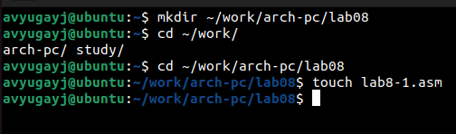

Открываем файл в Midnight Commander и заполняем его в соответствии с листингом 8.1

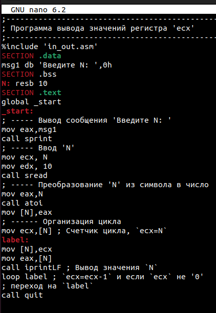

Создаем исполняемый файл и запускаем его

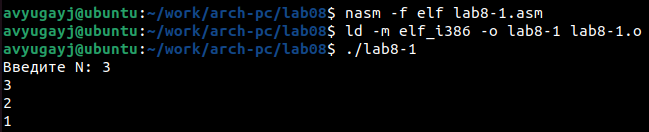

Снова открываем файл для редактирования и изменяем его, добавив изменение значения 
регистра в цикле

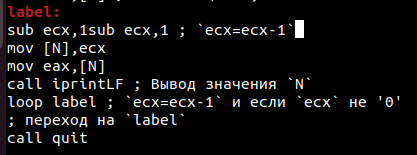

Создаем исполняемый файл и запускаем его

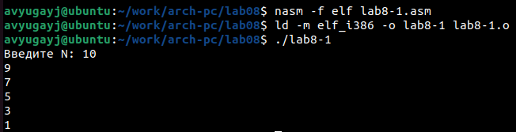

Регистр ecx принимает значения 9,7,5,3,1(на вход подается число 10, в цикле label данный 
регистр уменьшается на 2 командой sub и loop).

Число проходов цикла не соответсвует числу N, так как уменьшается на 2.

Снова открываем файл для редактирования и изменяем его, чтобы все корректно работало 

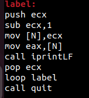

Создаем исполняемый файл и запускаем его 

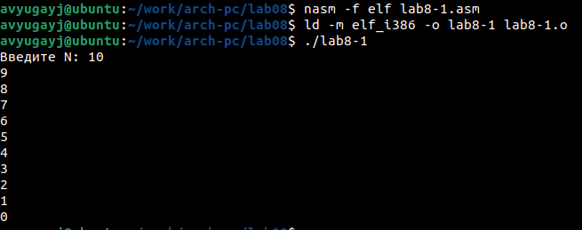

В данном случае число проходов цикла равна числу N.

## Обработка аргументов командной строки.

Создаем новый файл

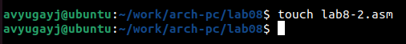

Открываем файл в Midnight Commander и заполняем его в соответствии с листингом 8.2 

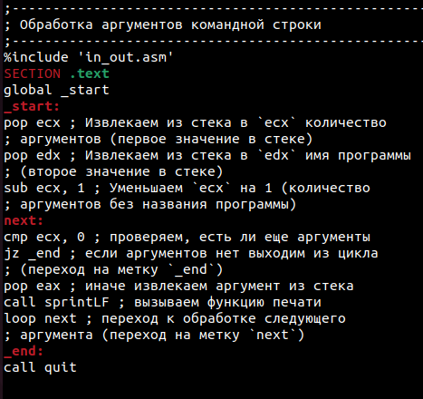

Создаем исполняемый файл и проверяем его работу, указав аргументы 

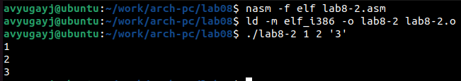

Програмой было обработано 3 аргумента.

Создаем новый файл lab8-3.asm

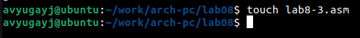

Открываем файл и заполняем его в соответствии с листингом 8.3

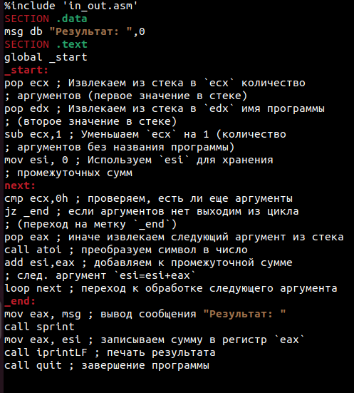

Создаём исполняемый файл и запускаем его, указав аргументы

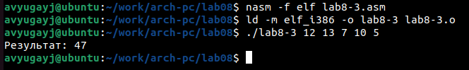

Снова открываем файл для редактирования и изменяем его, чтобы вычислялось произведение 
вводимых значений 

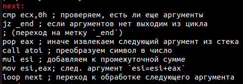

Создаём исполняемый файл и запускаем его, указав аргументы

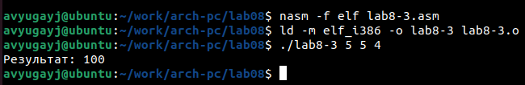

## Задание для самостоятельной работы

Вариант 3

Напишите программу, которая находит сумму значений функции f(x) для
x = x1, x2, ..., xn, т.е. программа должна выводить значение f(x1) + f(x2) + ... + f(xn).
Значения xi передаются как аргументы. Вид функции f(x) выбрать из таблицы
8.1 вариантов заданий в соответствии с вариантом, полученным при выполнении
лабораторной работы № 7. Создайте исполняемый файл и проверьте его работу на
нескольких наборах x = x1, x2, ..., xn.

Создаем новый файл 

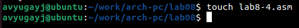

Открываем его и пишем программу, которая выведет сумму значений, получившихся после 
решения выражения 10x-5

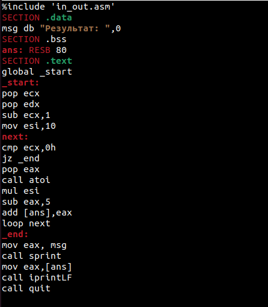

Транслируем файл и смотрим на работу программы 

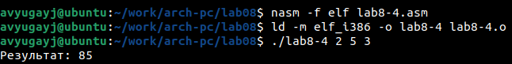

Транслируем файл и смотрим на работу программы

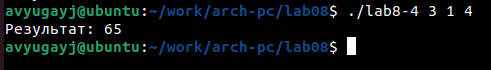

# Выводы

Мы научились решать программы с использованием циклов и обработкой аргументов 
командной строки.

