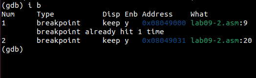
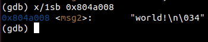
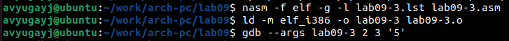

---
## Front matter
title: "Отчёт по лабораторной работе №9"
subtitle: "Понятие подпрограммы. Отладчик GDB."
author: "Югай Александр Витальевич"

## Generic otions
lang: ru-RU
toc-title: "Содержание"

## Bibliography
bibliography: bib/cite.bib
csl: pandoc/csl/gost-r-7-0-5-2008-numeric.csl

## Pdf output format
toc: true # Table of contents
toc-depth: 2
lof: true # List of figures
lot: true # List of tables
fontsize: 12pt
linestretch: 1.5
papersize: a4
documentclass: scrreprt
## I18n polyglossia
polyglossia-lang:
  name: russian
  options:
	- spelling=modern
	- babelshorthands=true
polyglossia-otherlangs:
  name: english
## I18n babel
babel-lang: russian
babel-otherlangs: english
## Fonts
mainfont: PT Serif
romanfont: PT Serif
sansfont: PT Sans
monofont: PT Mono
mainfontoptions: Ligatures=TeX
romanfontoptions: Ligatures=TeX
sansfontoptions: Ligatures=TeX,Scale=MatchLowercase
monofontoptions: Scale=MatchLowercase,Scale=0.9
## Biblatex
biblatex: true
biblio-style: "gost-numeric"
biblatexoptions:
  - parentracker=true
  - backend=biber
  - hyperref=auto
  - language=auto
  - autolang=other*
  - citestyle=gost-numeric
## Pandoc-crossref LaTeX customization
figureTitle: "Рис."
tableTitle: "Таблица"
listingTitle: "Листинг"
lofTitle: "Список иллюстраций"
lolTitle: "Листинги"
## Misc options
indent: true
header-includes:
  - \usepackage{indentfirst}
  - \usepackage{float} # keep figures where there are in the text
  - \floatplacement{figure}{H} # keep figures where there are in the text
---

# Цель работы

Познакомиться с методами отладки при помощи GDB, его возможностями.

# Выполнение лабораторной работы

## Реализация подпрограмм в NASM

Создаем каталог для программ ЛБ9, и в нем создаем файл 

Открываем файл в Midnight Commander и заполняем его в соответствии с листингом 9.1

Создаем исполняемый файл и запускаем его

Снова открываем файл для редактирования и изменяем его, добавив подпрограмму в 
подпрограмму(по условию)

Создаем исполняемый файл и запускаем его 

## Отладка программам с помощью GDB

Создаем новый файл в каталоге

Открываем файл в Midnight Commander и заполняем его в соответствии с листингом 9.2

Получаем исходный файл с использованием отладчика gdb

Запускаем команду в отладчике

Устанавливаем брейкпоинт на метку _start и запускаем программу

Смотрим дисассимилированный код программы с помощью команды disassemble, начиная с метки 
_start

Переключаемся на отображение команд с Intel’овским синтаксисом

Различия отображения синтаксиса машинных команд в режимах ATT и Intel:

1.Порядок операндов: В ATT синтаксисе порядок операндов обратный, сначала указывается 
исходный операнд, а затем - результирующий операнд. В Intel синтаксисе порядок обычно прямой, 
результирующий операнд указывается первым, а исходный - вторым.

2.Разделители: В ATT синтаксисе разделители операндов - запятые. В Intel синтаксисе 
разделители могут быть запятые или косые черты (/).

3.Префиксы размера операндов: В ATT синтаксисе размер операнда указывается перед операндом 
с использованием префиксов, таких как 'b' (byte), 'w' (word), 'l' (long) и 'q' (quadword). В Intel 
синтаксисе размер операнда указывается после операнда с использованием суффиксов, таких как 
'b', 'w', 'd' и 'q'.

4.Знак операндов: В ATT синтаксисе операнды с позитивными значениями предваряются 
символом '$'. В Intel синтаксисе операнды с позитивными значениями могут быть указаны без 
символа '$'.

5.Обозначение адресов: В ATT синтаксисе адреса указываются в круглых скобках. В Intel 
синтаксисе адреса указываются без скобок.

6.Обозначение регистров: В ATT синтаксисе обозначение регистра начинается с символа '%'. В 
Intel синтаксисе обозначение регистра может начинаться с символа 'R' или 'E' (например, 
'%eax' или 'RAX').

Включаем режим псевдографики

Проверяем была ли установлена точка останова и устанавливаем точку останова предпоследней 
инструкции

Посмотрим информацию о всех установленных точках останова

Выполняем 5 инструкций командой si 

Во время выполнения команд менялись регистры: ebx, ecx, edx,eax, eip.
Смотрим значение переменной msg1 по имени

Смотрим значение переменной msg2 по адресу

Изменим первый символ переменной msg1

Изменим первый символ переменной msg2

Смотрим значение регистра edx в разных форматах

Изменяем регистор ebx

Выводится разные значения, так как команда без кеавычек присваивает регистру вводимое 
значение.

Прописываем команды для завершения программы и выхода из GDB

Копируем файл lab8-2.asm в файл с именем lab09-3.asm

Создаем исполняемый файл и запускаем его в отладчике GDB 

Установим точку останова перед первой инструкцией в программе и запустим ее

Смотрим позиции стека по разным адресам

Шаг изменения адреса равен 4 потому что адресные регистры имеют размерность 32 бита(4 
байта).

## Задание для самостоятельной работы

### Задание 1

Копируем файл lab8-4.asm(ср №1 в ЛБ8) в файл с именем lab09-4.asm

Открываем файл в Midnight Commander и меняем его, создавая подпрограмму

Создаем исполняемый файл и запускаем его

### Задание 2 

Создаем новый файл в дирректории 

Открываем файл в Midnight Commander и заполняем его в соответствии с листингом 9.3

Создаем исполняемый файл и запускаем его

Создаем исполняемый файл и запускаем его в отладчике GDB и смотрим на изменение решистров 
командой si

Изменяем программу для корректной работы 

Создаем исполняемый файл и запускаем его

# Выводы

Мы познакомились с методами отладки при помощи GDB и его возможностями.

